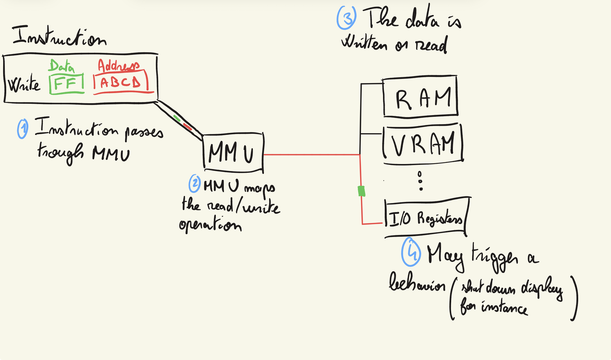
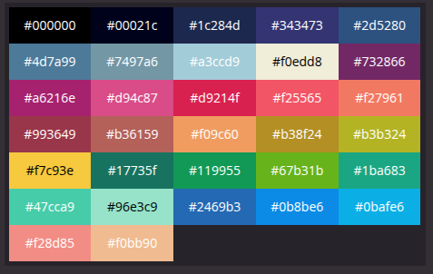
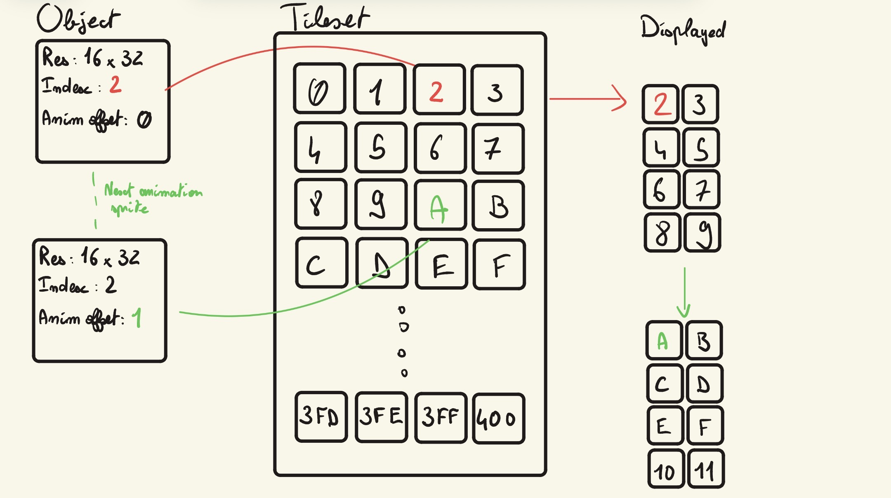
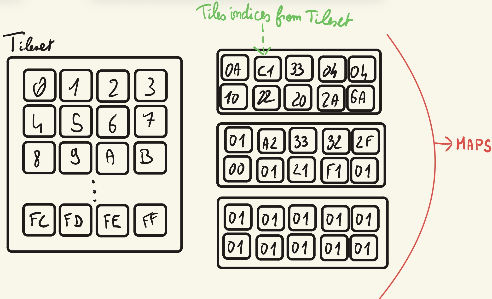
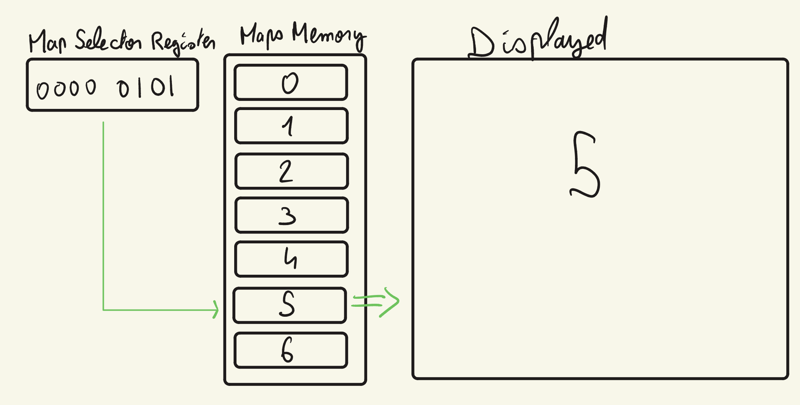
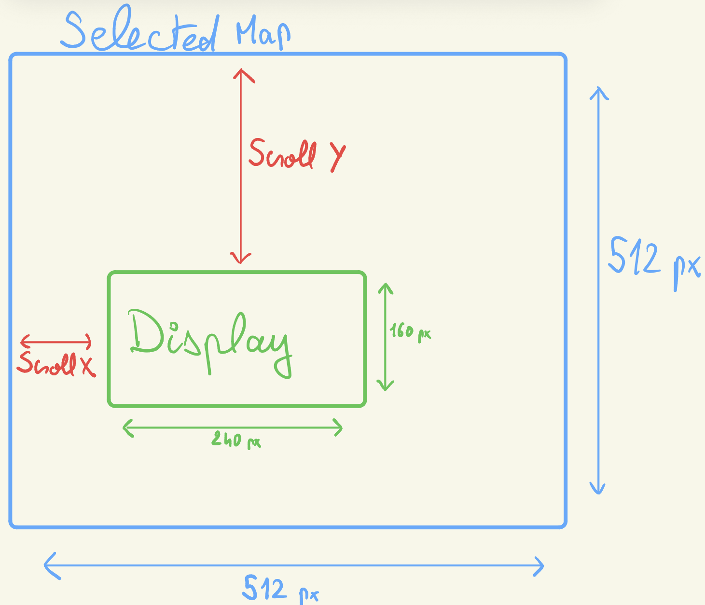
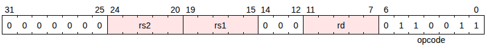

# MARGE-CONSOLE

# Install
You need 2 dependencies in order for make to compile console and games : 
- RiscV compiler : sudo apt install gcc-riscv64-linux-gnu
- SDL2 : https://wiki.libsdl.org/SDL2/Installation
*Todo: Maybe work with CMake to make it cross platform and packageable*


# Console
The Marge Console is a fantasy console, as it's core, it is based on a RISC-V CPU architecture. The console accepts RISC V ROMs.

We plan to create a custom C library to program ROMs and map it to a custom No-Code language.


## Memory Map

The Console use a Memory Mapping system, each read/write passes through an **MMU** (Memory Management Unit) *  

\* *--Still called bus here - needs to change--*


The MMU switches the address and route it to the "hardware" in charge of handling the read or write.

Some of the reads or writes may have a behavior (writing to the **screen control register** may enable/disable the display for instance)

*exemple:*


### Cartridge

`0x00000000 to 0x04000000`

This whole space represents the cartridge that will be loaded into the MARGE SYSTEM, it is composed of :

#### Cart HEADER
TBD `0x00000000 to 0x03FDFFFF`

This space is used in order to verify that the loaded ELF is indeed targetting our architecture.
It is composed of :
- A 9 bytes magic number : `0x4D` `0x61` `0x72` `0x67` `0x65` `0x5F` `0x53` `0x79` `0x73` "Marge_Sys"
- A 32 bytes title string
- A 32 bytes author string
- A major version byte
- A minor version byte
- A revision version byte

#### ROM
`0x00000000 to 0x03FDFFFF`

This is where the CPU's program counter is going to fetch instructions to execute. Writing on this address space is forbidden.

#### Cart RAM
`0x03FE0000 to 0x03FFFFFF`

This external RAM "chip" is where data is going to be saved. 128Kb are available. 

### Framebuffer
`0x04000000 to 0x04009600`

This space contains the raw color indexes that are going to be displayed on the next frame


### RAM
`0x0404B000 to 0x0406AFFF`

This space is mapped to the MARGE system RAM.


# Tiles and Objects

## Tiles
Tiles are 8x8 indices of color palette that will be stored in the tileset (located at `0x0406C000`).

1024 (0x400) tiles are stored in the tileset.

The color palette for the reference :



*if the first 4 bytes of a tile are `0x05 0x10 0x15 0x0B`, the first 4 pixels are going to be 'light blue, light brown, dark green, light purple'* 

## Objects

Objects are a data structure located in OAM (Object Attribute Memory)

### Data structure

An object is composed of:
- X position: X position on the screen minus a 32 pixels offset
- Y position: Y position on the screen minus a 32 pixels offset
- tile index: The top left tile of the object
- animation sprites: The number of tiles that the animation is composed of *need to think more about how legitimate this is*
- flags : A 16 bits flag register


### Flag register

```
[15][    14-10    ][09][  08-06  ][  05-02  ][01][00]


[00]: If set, the X axis is flipped (tile object is displayed mirrored on the X axis)

[01]: If set, the y axis is flipped (tile object is displayed mirrored on the y axis)

[05-02]: Object resolution, 9 possible values (6 wasted possibilities), possible values are 8x8, 8x16, 8x32, 16x8, 16x16, 16x32, 32x8, 32x16, 32x32

[08-06]: Object animation offset, this is added to the tile index in order to select the tile to display

[09]: If set, the color index 00 is displayed as transparent, black otherwise

[14-10]:  The duration of an animation sprite (0-31)

[15]: TBD
```

### Object displaying

The tiles are stored in the X axis first, the Y axis.
If a tile is 16x32, we store the 8x8 tile like : 
Top Left, Top Right, Middle Left [...], Bottom Right





# Display

The MARGE system displays a screen of 240x160


## Map

The Map layer displays a background that is selected from the Maps memory.

A Map is composed of indices to tiles in the Tileset  



The MARGE console can address up to **NUMBER TO BE DEFINED** maps in the memory, the map that is going to be displayed is selected by the **Map index register**.



The map is 512x512 pixels, as the screen is 240x160 pixels wide, what part of the map that is going to be displayed depends on the **Scroll X and Scroll Y registers**


# IO
The Input/Output is handled by registers located in this memory space.

`0x0406B000 to 0x0407BFFF`

## Joypad register(s?)
The joypad is encoded on 8bits, when a key is pressed, the corresponding bits are **enabled** in the joypad register :
- UP KEY:       bit 0 (0x1)
- LEFT KEY:     bit 1 (0x2)
- DOWN KEY:     bit 2 (0x4)
- RIGHT KEY:    bit 3 (0x8)
- A KEY:        bit 4 (0x10)
- B KEY:        bit 5 (0x20)
- START KEY:    bit 6 (0x40)
- SELECT KEY:   bit 7 (0x80)

`Joypad 0: 0x0406B000`

## System registers

The registers that are going to influence the system's behavior

| Name    | Address  | Behavior |
| -------- | ------- | -------- |
| Map index register  | 0x406B002    |    The index of the background pointed tthe backgroundo map, the console displays the background corresponding to the `base maps address offset + the maps size x the index`     |
| Scroll X | 0x0406B004     |   Set the X axis offset from the left of the selected map that is going to be displayed       |
| Scroll Y   | 0x0406B006    |    Set the Y axis offset from the top of the selected map that is going to be displayed      |


---------
------
----
----

# OLD README

## Testing the CPU

### R TYPE

ADD: 

Test:
- `ADD x1(1), x1(1), x2($FFFFFFFF) => x1 = -1`
```
x1:= 1
x2:= $FFFFFFFF
0000 0000 0010 0000 1000 0000 1011 0011
00        20        80        B3
B3 80 20 00
```

- `ADD x1($80000000), x1($80000000), x2(1) => x1 = Max negative value`
```
x1:= $80000000
x2:= 1
0000 0000 0010 0000 1000 0000 1011 0011
00        20        80        B3
B3 80 20 00
```

## Memory Map

The 32 bit architecture is able to adress ~4.1Gib

### [0x00000000 - 0x03FFFFFF]: Cartridge memory 

**~64Mib** Reading/Writing on this space will interact with the cartridge
 
- `[0x00000000 - 0x03FDFFFF] ROM Memory` This adress space is readonly, it is where all programs instructions are stored with game data (sprites, audio...) 
- `[0x03FE0000 - 0x03FFFFFF] RAM Memory` This ~128Kib adress space is for embedded RAM into the cartridge. This space can be readen from / written to in order to load/save data

### [0x04000000 - 0x0404AFFF]: Video adress space (to extend)

- `[0x04000000 - 0x0404AFFF] Framebuffer` Contains pixels to be displayed on the 240x160px display. Data is encoded as 1 byte per pixel ([5:0]: index to one of the 32 colors in the palette)

### [0x404B000 - 0x406AFFF] RAM

### [0x406B000 - ] IO Adresses
#### Controllers
Controller state is stored on a single byte, bit 6 and 7 are selectors in order to know what we want to read and the other six bits are state of the observed buttons.

**Not sure yet how to handle the writing** :
*There my be no need to store state when it change, i can just poll the state when asked by the ROM*
 
*Exemple with states of bits [6-7]:*
- `00 - Bit 0 to 5 represents respectively: Right, Left, Up, Down, Select, Start`
- `01 - Bit 0 to 5 represents respectively: A, B, X, Y, R trigger, L trigger`
- `10 - Bit 0 to 5 represents respectively: TBD`
- `11 - Bit 0 to 5 represents respectively: TBD`

`[0x406B000] First controller` 

## To think about

- How to handle cartridge memory: allocating 64Mib for the program lifetime seems a lot when cartridge may be only 1Mib or less


## Palette


## Console audio


*Check if a process is using a device:* `fuser -v /dev/snd/*`


**The console audio**

The console will have 4 square wave audio channels + a noise generator channel
We are way less limited than the DMG's APU in terms of registers available but need to keep in mind some sort of using sparingly memory.

Naming convention : 
For the general audio registers : Audio reg n -> ARn

For the individuals channels registers : Channel x reg n -> CxRn

**General audio registers**

General enable register `[AR0]` : Used to enable/disable the full APU (bit0) or individuals channels. Enable == 1

Master volume control register `[AR1]` : Used to set Left and Right volume

| Register | 7 | 6 | 5 | 4 | 3 | 2 | 1 | 0 |
|------|---|---|---|---|---|---|---|---|
|   `[AR0]`   |  TBD |  Enable C5 |  Enable C4 |  Enable C3 |  Enable C2 |  Enable C1 |  Enable C0 |  APU enable |
|    `[AR1]`  | [x]  |  [x] |  [x] | LEFT Volume  |  [x] | [x]  | [x]  | RIGHT Volume  |
*When a bit value is [x] it means it is the same purpose as previous bit*


**Channels registers**

*8192 Hz seems like a fine maximum frequency so it need one full 8bit register + 5 bit of another one, leaving 3 bits.
We could use those 3 bits as a decimal approximation (Like, one bit = 0.14 Hz)? Not sure if it is usefull at high frequencies but sure helps with pitch accuracy at lower freq*

| Register | 7 | 6 | 5 | 4 | 3 | 2 | 1 | 0 |
|------|---|---|---|---|---|---|---|---|
|   `[C0R0]`   |  TBD |  Enable C5 |  Enable C4 |  Enable C3 |  Enable C2 |  Enable C1 |  [x] |  Freq LSB |
|    `[AR1]`  | [x]  |  [x] |  [x] | LEFT Volume  |  [x] | [x]  | [x]  | RIGHT Volume  |
```
[C0R0]: [ffffffff]
[C0R1]: [dddfffff]
f: Frequency -> 5 MSB on C0R1 + 8 LSB on C0R0
d: Frequency fractionnal part approximation (value * 10/7)
```
Each channel should have a master volume 