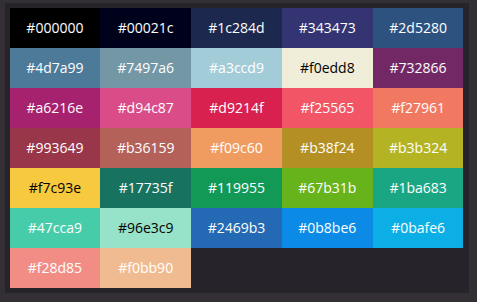

# 3. Graphics Overview

The {{console}} fantasy console is able to display up to 32 colors. It has several layers of display that you will learn about in this section.

## Colors

Colors are the most basic graphical data structure of the console, they are represented as an index to a fixed palette hardcoded in the *"hardware"*. Every graphics asset is an array of 8-bit indexes to the color needed to be displayed. 

*The 32 colors palette :*


!!! note

    The values `0, 12, 4` would be displayed as `black, red, blue` pixels.

*Many thanks to [Jehkoba](https://lospec.com/palette-list/jehkoba32) for the palette.*


## Tile

A tile is an 8x8 array of pixels/color-indexes, there is up to **1024 tiles** that can live at the same time in console's tileset memory.

For instance, a tile defined as so :

``` c
static char CREEPY_GUY[64] = {
    10, 10, 10, 10, 10, 10, 10, 10, 
    10, 02, 02, 02, 02, 02, 02, 10, 
    02, 02, 02, 02, 02, 02, 02, 02, 
    02, 02, 12, 02, 02, 12, 02, 02, 
    02, 02, 02, 02, 02, 02, 02, 02, 
    02, 23, 02, 02, 02, 02, 23, 02, 
    02, 02, 23, 23, 23, 23, 02, 02, 
    02, 02, 02, 02, 02, 02, 02, 02, 
};
```

Would be displayed as so :


## Tileset

The tileset is a memory region where the created tiles can be **stored** to be used and **displayed** by the console.

There is up to **1024 tiles** that can live *at the same time* in console's tileset.

Tiles that are used in a game to be displayed can only be displayed as an index to their location in the tileset. 

!!! warning

    The index must be a 16-bit word as there is more than 255 possible memory storage.
    That is a waste of space but we wanted to limit the size of the tileset without going
    as low as 255 tiles but not to the extent of 65535 tiles either.
